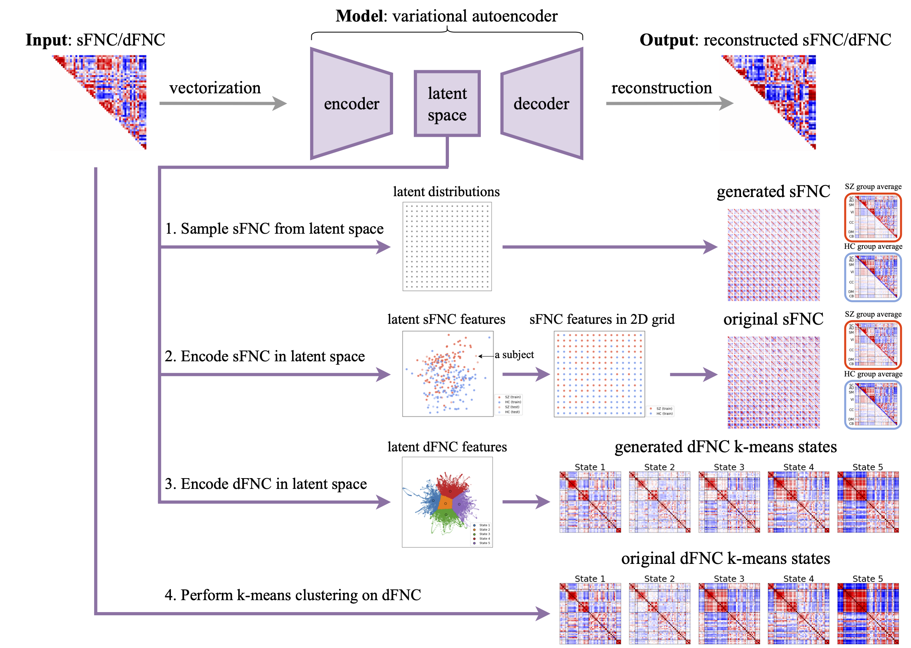

# Functional network connectivity interpolation

Code for the manuscript: Brain functional network connectivity interpolation characterizes neuropsychiatric continuum and heterogeneity (under review)



## Environment setup

1. Clone the repository
```
git clone https://github.com/trendscenter/interpolation.git
cd interpolation
```

2. Create a conda environment
```
conda create --name interp python=3.12
conda activate interp
```

3. Install the required packages
```
pip install -r requirements.txt
```

## Experiments

SFNC interpolation: [interp_sfnc_sz.ipynb](interpolation/interp_sfnc_sz.ipynb), [interp_sfnc_asd.ipynb](interpolation/interp_sfnc_asd.ipynb)

DFNC interpolation: [interp_dfnc_sz.ipynb](interpolation/interp_dfnc_sz.ipynb), [interp_dfnc_asd.ipynb](interpolation/interp_dfnc_asd.ipynb)

## Visualization

Figure 2: [plot_comparison.ipynb](visualization/plot_comparison.ipynb)

Figure 3: [interp_sfnc_sz.ipynb](interpolation/interp_sfnc_sz.ipynb)

Figure 4: [interp_sfnc_asd.ipynb](interpolation/interp_sfnc_asd.ipynb)

Figure 5: [plot_subject_measure.ipynb](visualization/plot_subject_measure.ipynb)

Figure 6: [plot_correlation.ipynb](visualization/plot_correlation.ipynb)

Figure 7: [interp_dfnc_sz.ipynb](interpolation/interp_dfnc_sz.ipynb)

Figure 8: [interp_dfnc_asd.ipynb](interpolation/interp_dfnc_asd.ipynb)

Figure 9: [plot_dynamic_metrics.ipynb](visualization/plot_dynamic_metrics.ipynb)

Figure 10: [plot_sfnc_latent_space.ipynb](visualization/plot_sfnc_latent_space.ipynb)

Figure 11: [plot_dfnc_latent_space.ipynb](visualization/plot_dfnc_latent_space.ipynb)

Figure 12: [plot_dfnc_latent_space.ipynb](visualization/plot_dfnc_latent_space.ipynb)

Figure 13: [plot_subject_measure.ipynb](visualization/plot_subject_measure.ipynb)

Figure 14a: [plot_hypopt_sfnc_vae.ipynb](visualization/plot_hypopt_sfnc_vae.ipynb)

Figure 14b: [plot_hypopt_dfnc_vae.ipynb](visualization/plot_hypopt_dfnc_vae.ipynb)

Figure 15: [plot_hypopt_sfnc_ivae.ipynb](visualization/plot_hypopt_sfnc_ivae.ipynb)

Figure 24: [plot_kmeans.ipynb](visualization/plot_kmeans.ipynb)

## Citation
If you find this repository useful, please cite the following paper:
```
@inproceedings{li2022mind,
  title={Mind the gap: functional network connectivity interpolation between schizophrenia patients and controls using a variational autoencoder},
  author={Li, Xinhui and Geenjaar, Eloy and Fu, Zening and Plis, Sergey and Calhoun, Vince},
  booktitle={2022 44th Annual International Conference of the IEEE Engineering in Medicine \& Biology Society (EMBC)},
  pages={1477--1480},
  year={2022},
  organization={IEEE}
}
```