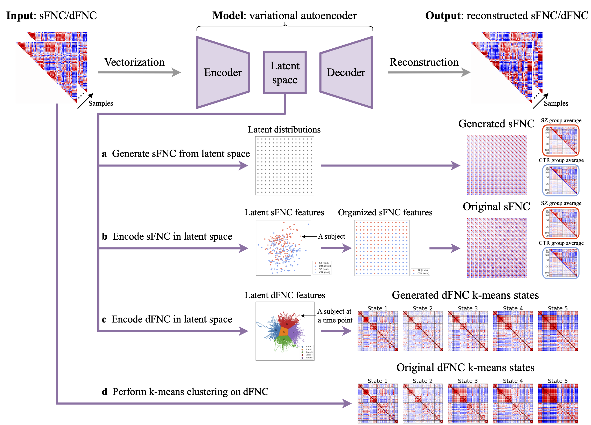

# Functional Network Connectivity Interpolation

Code for the preprint: [Brain functional network connectivity interpolation characterizes neuropsychiatric continuum and heterogeneity](https://www.biorxiv.org/content/10.1101/2024.11.13.623318v1) (under review)



## Environment setup

1. Clone the repository
```
git clone https://github.com/XinhuiLi/interpolation.git
cd interpolation
```

2. Create a conda environment
```
conda create --name interp python=3.12
conda activate interp
```

3. Install the required packages
```
pip install -r requirements.txt
```

## Experiments

### Static functional network connectivity (sFNC) interpolation 

FBIRN data: [interp_sfnc_sz.ipynb](interpolation/interp_sfnc_sz.ipynb)

ABIDE I data: [interp_sfnc_asd.ipynb](interpolation/interp_sfnc_asd.ipynb)

### Dynamic functional network connectivity (dFNC) interpolation 

FBIRN data: [interp_dfnc_sz.ipynb](interpolation/interp_dfnc_sz.ipynb) 

ABIDE I data: [interp_dfnc_asd.ipynb](interpolation/interp_dfnc_asd.ipynb)

## Visualization

Figure 2: [plot_comparison.ipynb](visualization/plot_comparison.ipynb)

Figure 3: [interp_sfnc_sz.ipynb](interpolation/interp_sfnc_sz.ipynb)

Figure 4: [interp_sfnc_asd.ipynb](interpolation/interp_sfnc_asd.ipynb)

Figure 5: [plot_subject_measure.ipynb](visualization/plot_subject_measure.ipynb)

Figure 6: [plot_correlation.ipynb](visualization/plot_correlation.ipynb)

Figure 7: [interp_dfnc_sz.ipynb](interpolation/interp_dfnc_sz.ipynb)

Figure 8: [interp_dfnc_asd.ipynb](interpolation/interp_dfnc_asd.ipynb)

Figure 9: [plot_dynamic_metrics.ipynb](visualization/plot_dynamic_metrics.ipynb)

Figure 10: [plot_sfnc_latent_space.ipynb](visualization/plot_sfnc_latent_space.ipynb)

Figure 11: [plot_dfnc_latent_space.ipynb](visualization/plot_dfnc_latent_space.ipynb)

Figure 12: [plot_dfnc_latent_space.ipynb](visualization/plot_dfnc_latent_space.ipynb)

Figure A.1: [plot_subject_measure.ipynb](visualization/plot_subject_measure.ipynb)

Figure E.1a: [plot_hypopt_sfnc_vae.ipynb](visualization/plot_hypopt_sfnc_vae.ipynb)

Figure E.1b: [plot_hypopt_dfnc_vae.ipynb](visualization/plot_hypopt_dfnc_vae.ipynb)

Figure E.2: [plot_hypopt_sfnc_ivae.ipynb](visualization/plot_hypopt_sfnc_ivae.ipynb)

Figure G.1: [plot_mse.ipynb](visualization/plot_mse.ipynb)

Figure H.1: [plot_kmeans.ipynb](visualization/plot_kmeans.ipynb)

## Acknowledgement

We thank the authors of [identifiable variational autoencoders](https://arxiv.org/abs/1907.04809) for making the [code](https://github.com/ilkhem/icebeem) publicly available.

## Citation
If you find this repository useful, please cite the following paper:
```
@article{li2024brain,
	author = {Li, Xinhui and Geenjaar, Eloy and Fu, Zening and Pearlson, Godfrey and Calhoun, Vince},
	title = {Brain functional network connectivity interpolation characterizes neuropsychiatric continuum and heterogeneity},
	elocation-id = {2024.11.13.623318},
	year = {2024},
	doi = {10.1101/2024.11.13.623318},
	publisher = {Cold Spring Harbor Laboratory},
	URL = {https://www.biorxiv.org/content/early/2024/11/14/2024.11.13.623318},
	eprint = {https://www.biorxiv.org/content/early/2024/11/14/2024.11.13.623318.full.pdf},
	journal = {bioRxiv}
}
```